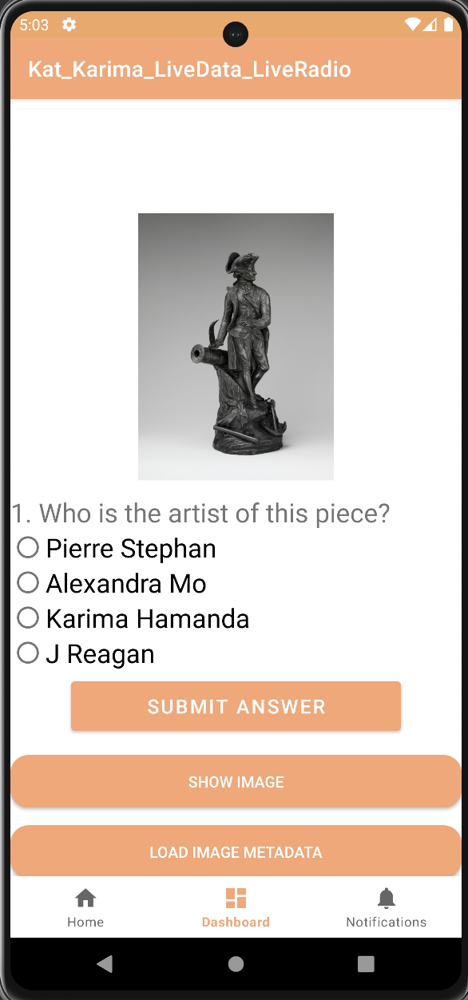
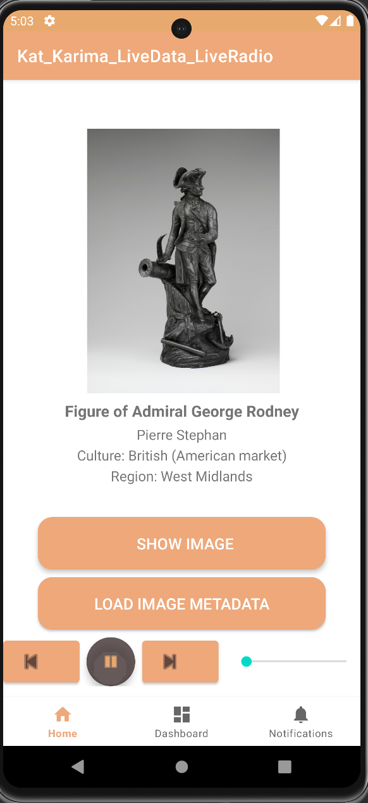

# CSE 3200 - Mobile-App Development
**Kat Reagan and Karima Hamada**
**Instructor: Dr. Philip Bradford**
**30 April 2024**

## Quick Note: 
- Here is a completed work. Please grade my **FINAL PROJECT-LOADING IMAGE LIBRARY FROM VOLLEY LIBRARY**

Happy coding!

## Description and Strategy
    For this lab, we built an Android app that uses Volley’s Library to load MET Museum images from their public domain REST server. At the start, the user is brought to the home fragment where they can click “show image” and “load image metadata” which work accordingly. We added a waiting room strategy that incorporates the following: a “show image” background screen that sits there as your default, and a cartoon image that sits behind your loaded image. This becomes visible if the image you want to load has a delay, that way you are always looking at something. While the user is “browsing,” they can pause/play and control the volume of 5 different stations. We also chose to have a quiz regarding the images/information. Clicking “ready to check your knowledge?” will direct the user from the home fragment to the dashboard fragment where the quiz is located.

